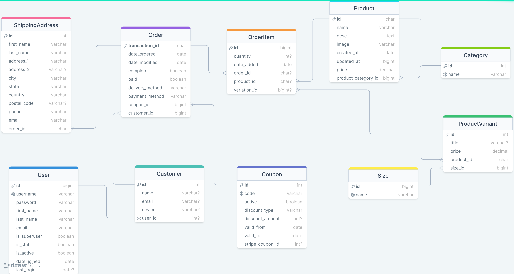

<h1 style="color:rgb(133, 24, 24); text-align:center">Django Pizza Delivery App</h1>

<h1>Live Demo</h1>
<a href="http://notarious2.pythonanywhere.com/">Visit</a> http://notarious2.pythonanywhere.com/

<h3>Admin credentials:</h3>

<p>http://notarious2.pythonanywhere.com/admin/</p>

```
login: bekzod
password: bekzod
```

<hr>
<p style="font-weight: bold;">This e-commerce app was built using the following technologies:</p>
<p float="left">


</p>
<h1>Features</h1>
<ul>
    <li>
        <p>Customer Registration, Login and Logout</p>
    </li>
    <li>
        <p>Customer and Guest Checkout (using device ID set in Cookies) </p>
    </li>
    <li>
        <p>Delivery and Carry-out option</p>
    </li>
    <li>
        <p>Registered users can see completed orders</p>
    </li>
    <li>
        <p>Deferred <strong>Cash</strong> payment and Instant online payment with Stripe</p>
    </li>

</ul>

<h1>SQL Relational Schema</h1>
<p>The app uses SQLite database. Relational representation of Django Models used in ePizza app are provided below. </p>
<p>Link to the diagram in <a href="https://drawsql.app/teams/bekzods-team-1/diagrams/epizza-django">drawSQL.app</a></p>


<h1>App Setup</h1>

**Clone Repository:**

```
git clone https://github.com/notarious2/Django-Pizza-Delivery.git
cd Django-Pizza-Delivery
```

**Create and Activate Virtual Environment:**

```
virtualenv env
env\Scripts\activate
```

**Install Dependencies:**

```
pip install -r requirements.txt
```

**Run Development Server:**

```
python manage.py runserver
```
