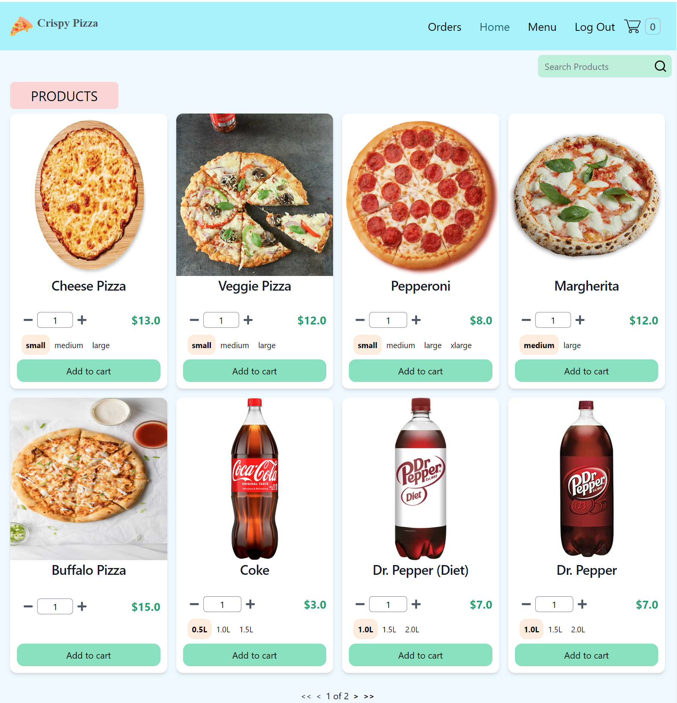
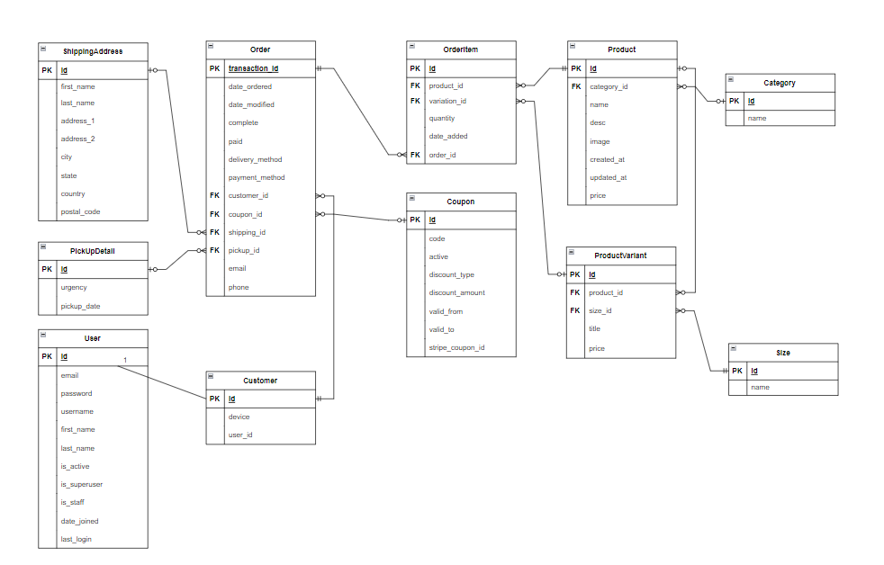

<h1 style="color:rgb(133, 24, 24); text-align:center">Django Pizza Delivery App</h1>

<h1>Live Demo</h1>
<a href="https://notarious2.pythonanywhere.com/">Visit</a> https://notarious2.pythonanywhere.com/



<h3>Admin credentials:</h3>

<p>https://notarious2.pythonanywhere.com/admin/</p>

```
login: admin/admin@example.com
password: admin
```

<hr>
<p style="font-weight: bold;">This e-commerce app was built using the following technologies:</p>
<p float="left">


</p>
<h1>Features</h1>
<ul>
    <li>
        <p>Customer Registration, Login and Logout. Customers may login with either <strong>email</strong> or <strong>username</strong></p>
    </li>
    <li>
        <p>Customer and Guest Checkout (using device ID set in Cookies) </p>
    </li>
    <li>
        <p>Delivery and Carry-out option</p>
    </li>
    <li>
        <p>Special <strong>Orders</strong> tab for registered users to view completed orders</p>
    </li>
    <li>
        <p>Deferred <strong>Cash</strong> payment and Instant online payment with <strong>Stripe</strong></p>
    </li>
    <li>
        <p><strong>99%</strong> test coverage with <strong>100+</strong> of both <strong>functional</strong> and <strong>unit tests</strong></p>
    </li>

</ul>

<h1>SQL Relational Schema</h1>
<p>The app uses SQLite database. Relational representation of Django Models used in ePizza app are provided below. </p>


<h1>Coupons</h1>
<p>3 coupons (integrated with Stripe Payment Gateway) are available at Checkout </p>

**WINTER:** 50% off the order total

**SUMMER:** $10 off the order total

<h1>App Setup</h1>

**Clone Repository:**

```
git clone https://github.com/notarious2/Django-Pizza-Delivery.git
cd Django-Pizza-Delivery
```

**Configure Environmental variables:**
<br>
_inside 'epizza' folder add .env file and add Secret Key, Stripe Publishable Key and Stripe Secret Key:_

```
SECRET_KEY=
STRIPE_PUBLISHABLE_KEY=
STRIPE_SECRET_KEY=
```
_To test Stripe's Percent Coupon (otherwise tests are automatically skipped) add:_

```
STRIPE_COUPON_ID_PERCENT=
```

**Create and Activate Virtual Environment:**

```
virtualenv env
env\Scripts\activate
```

**Install Dependencies:**

```
pip install -r requirements.txt
```

**Run Development Server:**

```
python manage.py runserver
```

<h1>Tailwind CSS Setup</h1>

_You must have Node.js installed in your PC_
<br>
_Tailwind Directives are in store/static/store/src/input.css_
<br>
_Output (autogenerated) stored in store/static/store/src/styles.css_

**Install Dependencies:**

```
npm install
```

**Start Tailwind CLI build process**

runs: "tailwind build -i store/static/store/src/input.css -o store/static/store/src/styles.css --watch" <strong>Script</strong> inside <strong>package.json</strong>

```
npm run build
```

<h1>Functional and Unit Tests</h1>
<p>The project contains <strong>60+</strong> both functional and unit tests.</p>

<p>Unit tests cover urls, models, forms and views</p>
<p>Functional testing is done using Selenium and django's StaticLiveServerTestCase</p>

**Run all tests**

```
python manage.py test
```

**Run functional tests**

Located in functional tests folder of a root directory. to see the testing process remove _options.add_argument('headless')_ in SetUp of each functional test

```
python manage.py test functional_tests
```

**Run unit tests**

```
python manage.py test users store orders
```

**Test coverage report**

```
coverage run manage.py test
```

to show report in command line:

```
coverage report
```

generates html report in <strong>test_coverage_report</strong> folder

```
coverage html
```
